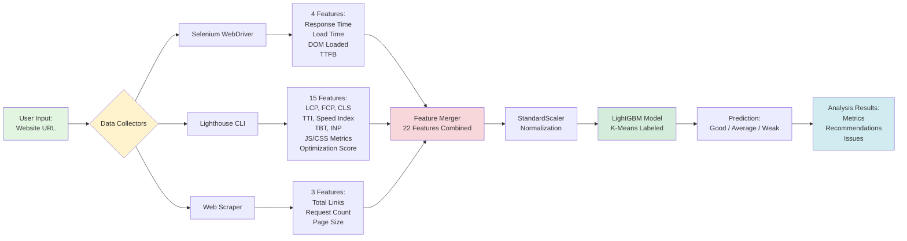

# 22 Performance Features Architecture

```mermaid
graph TB
    Root[22 Performance Features<br/>Website Performance Analysis]
    
    Root --> CWV[Core Web Vitals<br/>3 Features]
    Root --> Loading[Loading Performance<br/>5 Features]
    Root --> Resource[Resource & Page Metrics<br/>6 Features]
    Root --> Network[Network Performance<br/>4 Features]
    Root --> JSCSS[JavaScript & CSS<br/>3 Features]
    Root --> Quality[Quality & Optimization<br/>1 Feature]
    
    CWV --> CWV1[Largest Contentful Paint<br/>LCP_ms<br/>Main content load time]
    CWV --> CWV2[Interaction to Next Paint<br/>INP_ms / Max_Potential_FID_ms<br/>Responsiveness metric]
    CWV --> CWV3[Cumulative Layout Shift<br/>CLS<br/>Visual stability score]
    
    Loading --> L1[First Contentful Paint<br/>FCP_ms<br/>First visible content]
    Loading --> L2[Speed Index<br/>Speed_Index_ms<br/>Visual completeness]
    Loading --> L3[Time to Interactive<br/>TTI_ms<br/>Full interactivity]
    Loading --> L4[Total Blocking Time<br/>TBT_ms<br/>Main thread blocking]
    Loading --> L5[Start Render Time<br/>Start_render_time_ms<br/>Initial render]
    
    Resource --> R1[Total Page Size<br/>Page_size_MB<br/>Overall page weight]
    Resource --> R2[Page Weight Bytes<br/>Byte_in_bytes<br/>Transfer size]
    Resource --> R3[Number of Requests<br/>No_of_requests<br/>HTTP requests count]
    Resource --> R4[Total Links Count<br/>Total_links<br/>Hyperlink count]
    Resource --> R5[Document Complete<br/>Document_complete_time_ms<br/>Full document load]
    Resource --> R6[Load Time<br/>Load_time_ms<br/>Complete page load]
    
    Network --> N1[Time to First Byte<br/>First_byte_TTFB_ms<br/>Server response start]
    Network --> N2[Response Time<br/>Response_time_ms<br/>Server response complete]
    Network --> N3[Server Response Time<br/>Server_Response_Time_ms<br/>Backend processing]
    Network --> N4[DOM Content Loaded<br/>DOM_Content_Loaded_Time_ms<br/>DOM ready time]
    
    JSCSS --> JS1[JavaScript Execution<br/>JavaScript_Execution_Time_ms<br/>JS processing time]
    JSCSS --> JS2[Main Thread Work<br/>Main_Thread_Work_CPU_ms<br/>CPU-intensive tasks]
    JSCSS --> JS3[CSS Blocking Time<br/>CSS_Blocking_Time_ms<br/>Render-blocking CSS]
    
    Quality --> Q1[Design Optimization Score<br/>Design_optimization_score<br/>Lighthouse Performance 0-100]
    
    style Root fill:#667eea,color:#fff
    style CWV fill:#f093fb,color:#000
    style Loading fill:#4facfe,color:#fff
    style Resource fill:#43e97b,color:#000
    style Network fill:#fa709a,color:#fff
    style JSCSS fill:#feca57,color:#000
    style Quality fill:#48dbfb,color:#000
    
    style CWV1 fill:#ffc8dd
    style CWV2 fill:#ffc8dd
    style CWV3 fill:#ffc8dd
    
    style L1 fill:#bde0fe
    style L2 fill:#bde0fe
    style L3 fill:#bde0fe
    style L4 fill:#bde0fe
    style L5 fill:#bde0fe
    
    style R1 fill:#d4f1d4
    style R2 fill:#d4f1d4
    style R3 fill:#d4f1d4
    style R4 fill:#d4f1d4
    style R5 fill:#d4f1d4
    style R6 fill:#d4f1d4
    
    style N1 fill:#ffd6e7
    style N2 fill:#ffd6e7
    style N3 fill:#ffd6e7
    style N4 fill:#ffd6e7
    
    style JS1 fill:#fff4cc
    style JS2 fill:#fff4cc
    style JS3 fill:#fff4cc
    
    style Q1 fill:#c8f4ff
```

## Feature Categories Breakdown

### 🔴 Category 1: Core Web Vitals (3 Features)
Critical user experience metrics defined by Google:
- **LCP**: Measures loading performance (< 2.5s = good)
- **INP/FID**: Measures interactivity (< 200ms = good)
- **CLS**: Measures visual stability (< 0.1 = good)

### 🔵 Category 2: Loading Performance (5 Features)
Page load progression metrics:
- **FCP**: First pixel rendered
- **Speed Index**: Visual completion speed
- **TTI**: When page becomes fully interactive
- **TBT**: Long task blocking time
- **Start Render**: Initial visual feedback

### 🟢 Category 3: Resource & Page Metrics (6 Features)
Asset and resource measurements:
- **Page Size**: Total download size
- **Byte Weight**: Transfer size in bytes
- **Request Count**: Number of HTTP requests
- **Links**: Total hyperlinks on page
- **Document Complete**: Full document loaded
- **Load Time**: Complete page load event

### 🟣 Category 4: Network Performance (4 Features)
Server and network timing:
- **TTFB**: First byte received from server
- **Response Time**: Complete server response
- **Server Response**: Backend processing time
- **DOM Loaded**: DOM construction complete

### 🟡 Category 5: JavaScript & CSS Performance (3 Features)
Script and style impact:
- **JS Execution**: JavaScript parsing & execution
- **Main Thread**: CPU-bound work duration
- **CSS Blocking**: Render-blocking stylesheets

### 🔵 Category 6: Quality & Optimization (1 Feature)
Overall performance assessment:
- **Optimization Score**: Lighthouse performance score (0-100)

---

## Feature Data Flow

## Technical Implementation

### Data Collection Tools
- **Selenium WebDriver**: Browser automation for timing metrics
- **Lighthouse CLI**: Google's performance audit tool
- **BeautifulSoup**: HTML parsing for structural analysis

### Model Architecture
- **Algorithm**: LightGBM Gradient Boosting
- **Labeling**: K-Means clustering (3 clusters)
- **Preprocessing**: StandardScaler normalization
- **Input**: 22 normalized features
- **Output**: 3-class classification (Good/Average/Weak)

### Feature Importance
Features are weighted differently in the model:
1. **Core Web Vitals** have highest importance
2. **Loading metrics** contribute significantly
3. **Resource metrics** indicate optimization opportunities
4. **Network metrics** show infrastructure quality
5. **JS/CSS metrics** reveal code efficiency
6. **Quality score** provides holistic assessment
