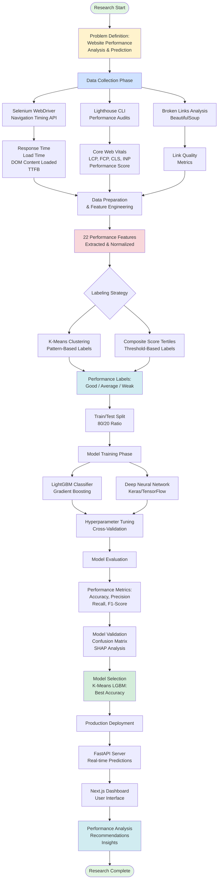

# Research Methodology Diagram

## Research Methodology Overview

### Phase 1: Problem Definition
- Identify the need for automated website performance analysis
- Define performance classification categories (Good, Average, Weak)

### Phase 2: Data Collection
- **Selenium WebDriver**: Collect navigation timing metrics
- **Lighthouse**: Perform comprehensive performance audits
- **Web Scraping**: Analyze link quality and page structure

### Phase 3: Feature Engineering
- Extract 22 performance features across 6 categories
- Normalize and preprocess data
- Handle missing values and outliers

### Phase 4: Labeling Strategy
- **K-Means Clustering**: Unsupervised pattern-based labeling
- **Tertiles Method**: Composite score threshold-based labeling

### Phase 5: Model Development
- Train multiple models (LightGBM, Neural Networks)
- Hyperparameter optimization
- Cross-validation for generalization

### Phase 6: Evaluation & Selection
- Compare model performance
- SHAP analysis for explainability
- Select best-performing model (K-Means LGBM)

### Phase 7: Deployment
- FastAPI backend for predictions
- Next.js frontend for visualization
- Real-time performance analysis

